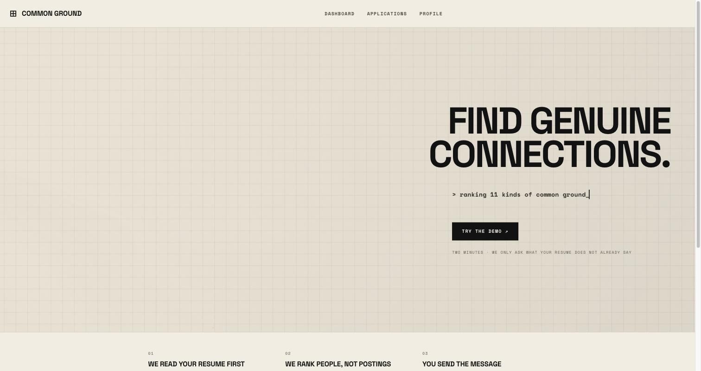
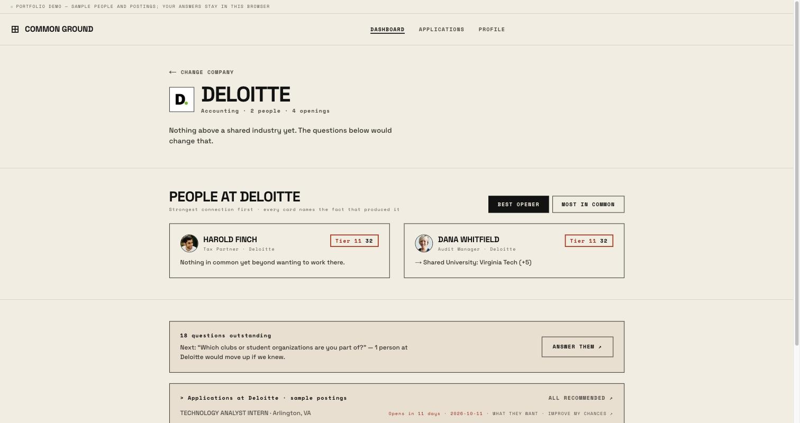
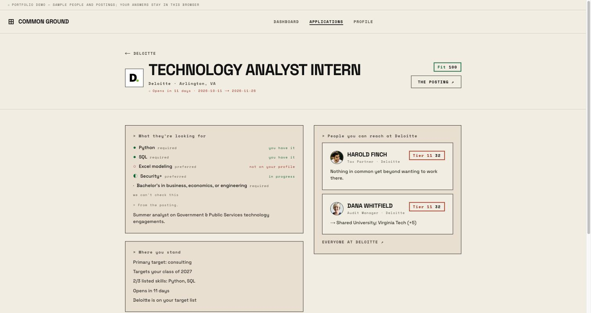

# Common Ground

Students land jobs through human connection, not AI-blasted applications. Common Ground ranks
*people* at a student's target companies by how strong a genuine, nameable commonality is (same
club, same hometown, same career jump), asks the student only for the facts their resume didn't
already give up, and shows what each internship asks for and how to close the gaps.

Built as a team project for a Databricks hackathon, September 2026.



| People at a company, most likely to refer you first | One opening: what they want, where you stand |
|---|---|
|  |  |

## Run the demo

```bash
npm install
npm run dev     # http://localhost:3000
```

No accounts, keys or database are needed. With no `.env.local` the app runs as a self-contained
portfolio demo:

- **No sign-in.** Each browser is its own student.
- **A sample student.** Reading a real resume needs a hosted model, so the demo starts from Sam Rivera,
  a Virginia Tech student whose resume has already been read. Everything after that step is the real
  flow: the questionnaire, the rankings, the openings and the plan agent.
- **Sample people and postings** (`src/lib/people/mock.ts`, `src/lib/positions/mock.ts`). Their dates
  move with the calendar (`src/lib/demo-clock.ts`), so the demo never goes stale.
- **Answers live in the browser**, in compressed cookies (`src/lib/session/demo-cookie.ts`). They
  survive reloads and server restarts, and any host works, including serverless platforms like Vercel
  where each request may reach a different instance.

The flow: pick the sample student → confirm what was read → answer only the questions the resume
left open → **dashboard**, where you pick a company and see who to write to there → **Applications**,
where each opening shows what it asks for, where you stand, and a plan for closing the gaps.

## Stack

Next.js 16 (App Router) · React 19 · TypeScript · Tailwind v4 · Zod · Vitest ·
Databricks (Delta tables, SQL Statement API, `ai_query`, Unity Catalog functions, Genie) ·
Supabase (auth and Postgres with row-level security, optional)

## Who is likely to refer you (1 to 5)

People are ranked by how likely they are to refer the student into a company they want
(`src/lib/referral/`). It asks two things: will this person act on the student's behalf, and will
their referral land at a company the student is targeting.

| | | Who |
|---|---|---|
| 5 | Very likely | Worked at the student's employer at the same time, more senior: has seen their work |
| 4 | Likely | Both named the same affinity organisation (SWE, NSBE, ...), or a close classmate: same school, within two years, same major or club |
| 3 | Possible | A real hook from the ladder below (shared club, employer, hometown, interest, a recent post or event), or a fellow alum |
| 2 | Unlikely | A campus recruiter, someone in the same field with no personal hook, or any stronger tie at a company the student is not targeting |
| 1 | Long shot | Nothing in common yet |

Then at most one step: up for two or more other warm contacts at the same company (several voices
inside), or for someone only a few years ahead; down for a director or above on a cold ask. Only
someone who has seen your work is a 5, and a recruiter never rises past 2. Affinity groups count
only when both people named the same one; nothing is inferred about who anyone is. Within a level,
the ladder's order holds. `referral.test.ts` pins each case.

## The ladder

The ladder no longer orders the lists, but it runs underneath: it finds the shared facts the
rating reads, writes the suggested opening line, and decides which questions would move people up.
It is one ranked list of what makes a connection worth writing to, strongest first.
It lives as data in `src/lib/affinity/tiers.ts`, including the outreach guidance for each rung.

| | |
|---|---|
| ~~1~~ | ~~Warm intro from a mutual contact~~ — **out of scope** |
| 2 | Same university **and** the same organisation or programme |
| 3 | Same university **and** they already made the move you're making |
| 4 | Shared employer, client or programme |
| 5 | Same hometown, high school or local community |
| ~~6~~ | ~~Shared mutual connection~~ — **out of scope** |
| 7 | A specific shared professional interest — concrete, not a field |
| 8 | They published something you can engage with *(decays over ~30 days)* |
| 9 | Same event, class or competition *(decays over ~72 hours)* |
| 10 | Exactly one step ahead of you |
| 11 | Same function, industry or company — no personal overlap |
| 12 | Same broad interest only |
| 13 | No connection beyond wanting a job there |

Tiers 1 and 6 need a private LinkedIn connection graph. We don't collect one, so they stay in the
table as greyed rows with the reason — a better answer than a list that quietly starts at 2.

## How it fits together

```
src/lib/affinity/   the scorer. Deterministic, pure, no LLM in the hot path.
src/lib/intake/     the questionnaire. Computed from what the resume left out.
src/lib/people/     the provider seam — mock by default, Databricks with PEOPLE_PROVIDER=databricks.
databricks/         the warehouse: schema, mock people with coffee-chat hooks, matching views, Genie, loader.
src/lib/ai/         Claude: resume extraction, job matching, answer structuring, tailoring.
src/lib/ats/        Greenhouse / Lever / Ashby / Workday ingestion (tested, not yet on a page).
```

**Scoring.** Each tier owns a band of eight points; the in-band bonus tops out at seven. Because
the bonus can never cross a band, sorting by score *is* sorting by tier — asserted from the table
in `ladder.test.ts`, not hardcoded. The highest tier wins outright: the ladder orders conversation
openers, not additive evidence. You open with one hook, and the rest make that same message
warmer. Three mediocre overlaps must not beat one shared fraternity.

**The homophily scorer is the second opinion.** `src/lib/homophily/scorer.ts` is a direct port of
`DynamicHomophilyScorer`: five shared factors (past employer, organisation, academic focus,
hometown, university), each worth a weight the student sets, added up, every firing factor named.
Where the ladder asks "what is the single best opener", this asks "how much do we have in common,
all told". On a company page, "Most in common" ranks by it and shows the weights form; the person
page shows the total and its drivers. Both sides pass through the same canonicaliser first, so
"VT" and "Virginia Polytechnic" still count as one university. `scorer.test.ts` runs the reference
script's two contacts and requires 70 and 15 with the reference's exact reason strings.

**Decay** decides whether a hit *survives*, not how far it slides. A four-day-old career fair
should stop being the opener, not become a weaker one — so below the floor the hit is dropped and
the person falls to whatever tier they otherwise match.

**Companies are chosen, not asked.** The questionnaire is about the person. Which companies to go
after is picked on the dashboard, one at a time, and written to `target_companies` from there; the
company page then ranks only the people who work there (plus a short tail of strong ties elsewhere).
`src/lib/companies/registry.ts` knows ~80 employers by name, alias, sector and domain, and
`npx tsx scripts/fetch-logos.ts` vendors their logos into `public/logos/` so no page makes a
third-party image request. Unknown companies get a monogram.

**The questionnaire is computed, not static.** `computeGaps` runs the field registry against what
extraction produced and asks only for the rest. A student who lists their clubs is never asked
about clubs. Two rules carry most of the weight:

- An explicit "none" **is an answer**. Tapping *I'm not in any* writes `[]` with `source: "answer"`
  and the question never returns. Without that distinction the form nags forever.
- Questions are ordered by real demand. When someone at a target company has a hometown and the
  student doesn't, the scorer emits an `unlockable`, and the question arrives saying *"we ask
  because Elena Cruz is from Norfolk."*

## Turning on accounts

Every account path is already written — sign-up, sign-in, sign-out, per-user storage, and row-level
security keyed on `auth.uid()`. What is missing is a project to point it at. Until there is one,
`isSupabaseConfigured()` is false, the sign-in pages pass straight through, and
`src/lib/session/demo-store.ts` keeps one student per browser behind the `cg_demo` cookie.

1. Create a free project at [supabase.com](https://supabase.com) (this needs your own login).
2. Run the three files in `supabase/migrations/` **in order** in the project's SQL editor, or
   `supabase db push` with the CLI. `0001` creates the tables, the owner-only RLS policies, and the
   `handle_new_user` trigger that gives every new account its `profiles` row; `0002` creates the
   private `documents` bucket; `0003` adds the questionnaire columns; `0004` adds the homophily
   weights column.
3. Copy `.env.example` to `.env.local` and fill in `NEXT_PUBLIC_SUPABASE_URL`,
   `NEXT_PUBLIC_SUPABASE_ANON_KEY` and `SUPABASE_SERVICE_ROLE_KEY` from Settings → API. Set the same
   three in Vercel (Settings → Environment Variables) and redeploy.

The anon key is meant to be public — RLS is what protects the data. The service role key bypasses
RLS entirely and belongs only on the server.

Supabase confirms email addresses by default, so `signUp` returns a user with **no session** and the
form says to go and open the link. Turning that off (Authentication → Providers → Email → "Confirm
email") makes sign-up log you straight in, which is the better setting for a demo where judges make
accounts on the spot.

## Running it for real

Everything the demo stubs out is built. Copy `.env.example` to `.env.local` and fill in what you want to turn on:

- **Databricks** (`DATABRICKS_HOST`, `DATABRICKS_WAREHOUSE_ID`, `DATABRICKS_TOKEN`, then
  `PEOPLE_PROVIDER=databricks`): 1,100 synthetic alumni, the real Summer 2027 Internships Directory
  (6,632 postings), resume reading with `ai_query`, sessions in a Delta table, and a plan agent that
  calls warehouse tools and rewrites the resume with a fabrication check. `databricks/README.md` has
  the schema, the loader (`make load`) and the Genie space.
- **Supabase** (`NEXT_PUBLIC_SUPABASE_URL`, `NEXT_PUBLIC_SUPABASE_ANON_KEY`,
  `SUPABASE_SERVICE_ROLE_KEY`): real accounts. See "Turning on accounts" above.
- **Anthropic** (`RESUME_PROVIDER=anthropic`, `ANTHROPIC_API_KEY`): read resumes with Claude instead
  of the warehouse.

Rows fetched from a provider are scored in memory and never written to Supabase. We hold no
standing database of people who never signed up, which is also why tiers 1 and 6 are out.

## Checks

```bash
npm test          # 184 tests
npm run typecheck
npm run lint
```

The ones worth knowing about:

- `ladder.test.ts` — eleven engineered people must rank exactly `[2,3,4,5,7,8,9,10,11,12,13]`, and
  a *minimum*-strength tier 2 must outscore a *maximum*-strength stack of tiers 3+4+5+7+11.
- `normalize.test.ts` — "Virginia Tech" / "VT" / "Virginia Polytechnic Institute and State
  University" collapse to one key, while UVA, Virginia Tech and VCU stay three. Richmond VA is not
  Richmond CA. Fuzzy matching is *refused* for schools: it is the most expensive error available.
- `specificity.test.ts` — "AI" scores 0.09, "responsible AI deployment for public-sector clients"
  scores 0.80, and a 30-phrase table guards the gate between them.
- `answers.test.ts` — answering every question with its skip drives `computeGaps` to zero. If that
  ever loops, a student can never finish.
- `decay.test.ts` — stubs `Date.now` to throw, proving no predicate reads the clock.

## Credits

A team project; the full commit history is preserved.

- **Roman Gorkowski**: the connection ladder and its scorer, the homophily scorer, the computed
  questionnaire, the website and its Terminal Brutalist interface, resume reading with `ai_query`,
  and this portfolio version of the demo.
- **Stephen Kidder**: the Databricks warehouse and synthetic alumni pool, the Summer 2027 internships
  directory, the plan agent and opening pages, warehouse-backed sessions, and the security review.
